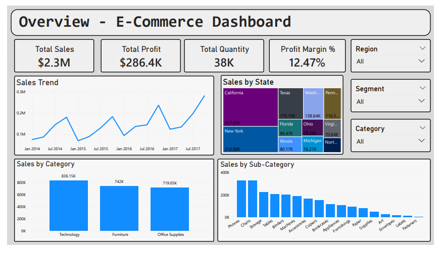
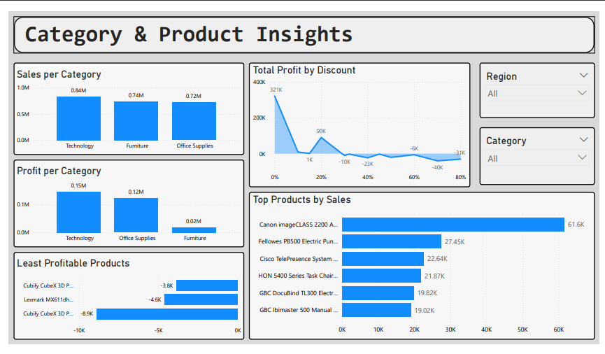
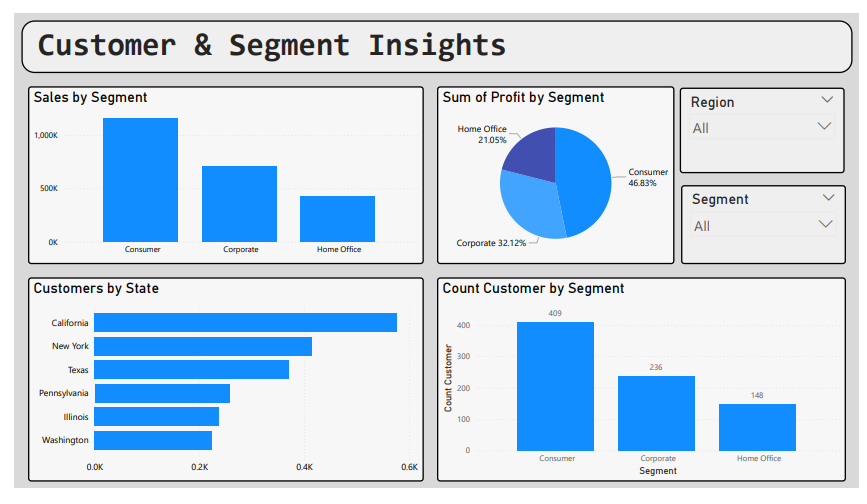
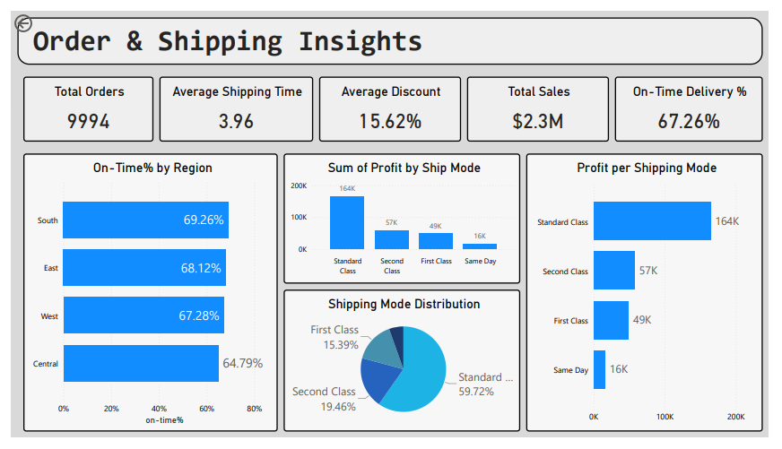

# E-commerce Sales Dashboard (Power BI)

## Overview
This project is a **Power BI dashboard** built on an e-commerce dataset.  
It provides insights into **Sales, Profitability, Customers, Products, and Shipping**.  
The goal is to demonstrate data storytelling and business intelligence skills.

## Key Features
- **Overview:** Total Sales ($2.3M), Profit, Quantity, Profit Margin %.
- **Category & Product Insights:** Top/least profitable products, Discount vs Profit analysis.
- **Customer & Segment Insights:** Sales distribution by Segment, Top Customers, Profit by Segment.
- **Order & Shipping Insights:** On-Time Delivery %, Profit by Ship Mode, Shipping Days by Region.

## Project Structure
- `dashboard/` → Power BI file (`E-commerce_Dashboard.pbix`) + PDF export
- `images/` → Screenshots of dashboard pages
- `data/` → Sample dataset (if shareable)

## Insights from the Dashboard
- California and New York contribute ~33% of total sales.
- Discounts >30% often lead to **negative profit** in Technology.
- On-Time Delivery % is lowest in Central region (64.7%), highest in South (69%).
- Corporate segment drives **46.8% of total profit**.

## Dashboard Preview
### Page 1: Executive Overview

### Page 2: Category & Product Insights

### Page 3: Customer & Segment Insights

### Page 4: Order & Shipping Insights

---

##  Tools Used
- **Power BI Desktop** (Data Visualization & BI)
- **DAX** (Calculated columns, measures)
- **CSV dataset** (Preprocessing)

---

## Conclusion
This dashboard demonstrates **business-focused data analysis** and **storytelling**.  
It can be extended with advanced KPIs such as Customer Lifetime Value, Forecasting, and Cohort Analysis.
